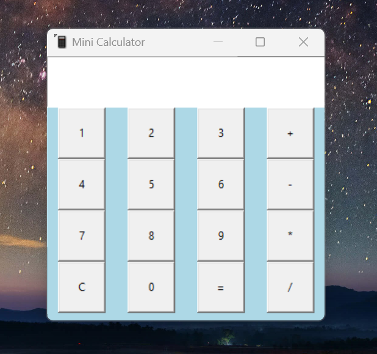

# Mini Calculator

 
 

<table>
  <tr>
    <td></td>
    <td></td>
  </tr>
</table>
 

 

<b>A Mini calculator app for basic arithmetic operations</b>

 

## ➡️ Description
This is a Mini calculator app for basic arithmetic operations built with python using the GUI package Tkinter. 
Built this app while learning GUI development using python. 
The application was converted to an executable file (.exe) using the pyinstaller package. 
It has 16 button keys with a display to view calculations and results. 

The app is able to do basic math operations: 
* Addition
* Subtraction
* Multiplication
* Division
  

## ➡️ Languages | Technologies

<table>
  <tr>
    <td>Programming Languages</td>
    <td>Python</td>
  </tr>
  <tr>
    <td>Frameworks</td>
    <td>Tkinter</td>
  </tr>
</table>
 

## ➡️ Installation
* Clone or download this repository

Method 1
* Open the dist folder and run minicalculator.exe

Method 2
* Ensure python is installed on your system
* Run python minicalculator.py